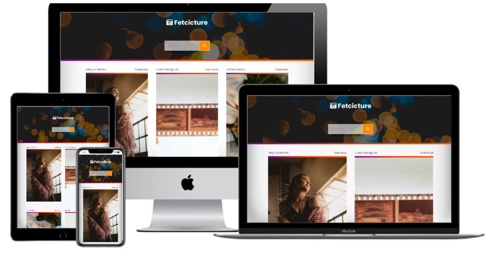

<h1 align = "center">
 
  
   
     
  Photo Fetch - Fetch/Image API
   
</ H1>

<h3 align = "center"> Interactive Front End Development </h3>

## Fetch Image Data

fetchApi

## Project Specifications

- The app utilizes the [Pexels API](https://www.pexels.com/api/)
- App obtains image
- The app gets image author-name
- The app captures the original image size
- The app generates a continuous assortment of pictures on demand
